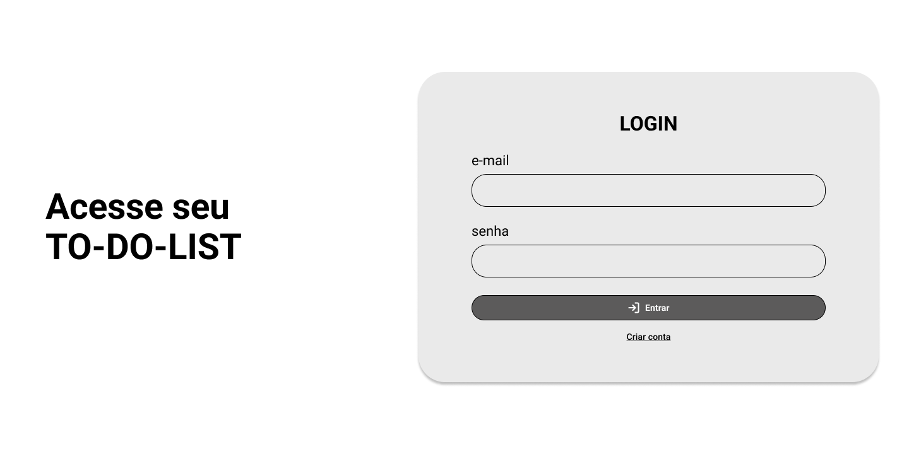
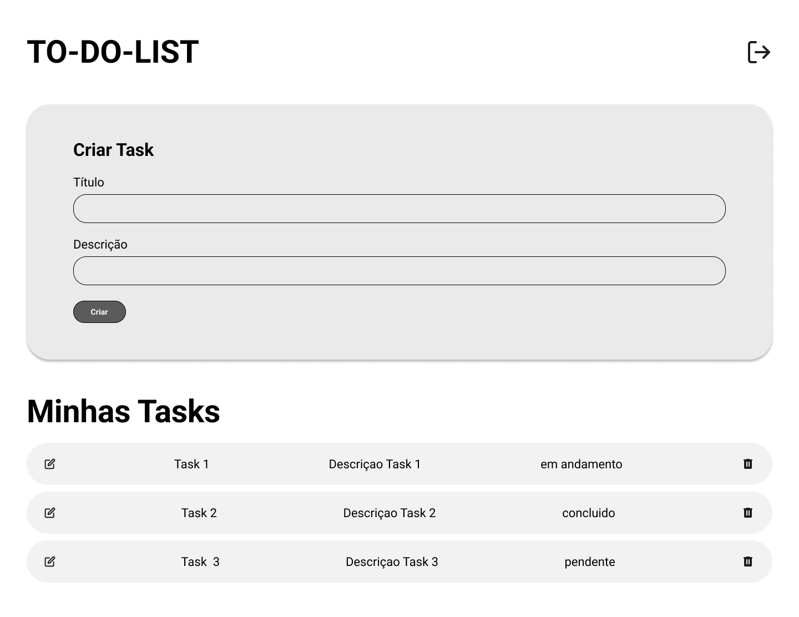

# To-Do List – Aplicação Full Stack

Este projeto é uma aplicação Full Stack de gerenciamento de tarefas (To-Do List), com autenticação de usuários, desenvolvida utilizando FastAPI no backend e React + TypeScript no frontend.

O objetivo do projeto é permitir que cada usuário:

- Crie uma conta
- Faça login
- Gerencie suas próprias tarefas (CRUD)
- Tenha acesso apenas às suas informações

---

# Tecnologias Utilizadas

Backend:

- Python 3.12
- FastAPI
- SQLAlchemy
- SQLite
- JWT (python-jose)
- Passlib (bcrypt)
- Uvicorn

Frontend:

- React
- TypeScript
- Vite
- Material UI (MUI)
- Axios
- React Router DOM

---

# Mockup de Referência
As telas abaixo (Login e Lista de Tarefas) foram usadas como **base visual** para o desenvolvimento da aplicação, não sendo idênticas ao resultado final. 

### Tela de Login 


### Tela de Lista de Tarefas 


---

# Como Executar o Projeto Localmente

Supondo que você já clonou o repositório na sua máquina.

## Backend (FastAPI)

Pré-requisitos:

- Python 3.12 ou superior
- Pip
- Git

### Passo a passo:

1. Acesse a pasta do backend:

   ```bash
   cd back
   ```

2. Crie um ambiente virtual:

   ```bash
   python -m venv venv //para Windows
   ```

3. Ative o ambiente virtual:

   ```bash
   source venv/Scripts/activate //para Windows
   ```

4. Instale as dependências:

   ```bash
   pip install -r requirements.txt
   ```
5. Verifique sua pasta .env:

   Crie um arquivo .env na raiz do back-end conforme o .env.example


6. Execute o servidor FastAPI:

   ```bash
   uvicorn app.main:app --reload
   ```

7. Verifique se o backend está funcionando:
   API: http://localhost:8000
   Swagger: http://localhost:8000/docs

## Frontend (React)

Pré-requisitos:

- Node.js 18+
- NPM ou Yarn

### Passo a passo:

1. Acesse a pasta do frontend:

   ```bash
   cd front
   ```

2. Instale as dependências:

   ```bash
   npm install
   ```

3. Execute o projeto frontend:

   ```bash
   npm run dev
   ```

4. Acesse no navegador:
   http://localhost:5173

---

Observações Importantes

- O backend deve estar rodando antes do frontend
- As portas padrão são:
  Backend: 8000
  Frontend: 5173
- Caso alguma porta esteja ocupada, ajuste no terminal ou nas configurações do Vite


